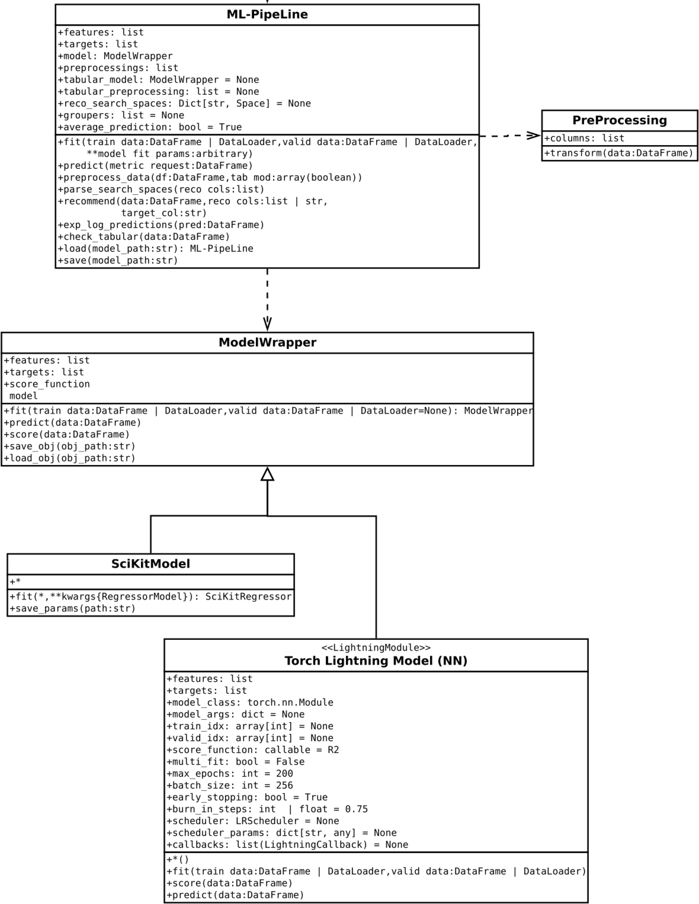

# Zero-Shot AD KPI Prediction

## Abstract

This package is meant to prepare and deliver models to predict / forecast business KPIs without any pre-runing.
This is the zero-shot part of this toolkit, because we do only learn from similar data.
Although, basically, one could also include recurrent, many-to-one, convolutional and other models.
Thus, the training data *can technically* be certain past data predicting the future.<br>
All features for the modelling are mostly preprocessed and thus just created on demand!
For instance which day of the week we have is either a categorical string, for 
catboost-like models, or a dummy for each category (one-hot encoded). <br>
(More about this in Methodology.)

## Prediction  Service

### Class Diagram of Main Actors

In the UML-chart below, the specific attributes of these steps are visible. 

<br>
*UML-Chart 2: Class diagram of the responsible objects internally.*

There are internally 2 main layers of abstraction:
1. Model/Inference pipeline (PipeLine)
2. Model(s) and Preprocessing(s)

Ideally, one would then provide a prediction service, translating the model output
into meaningful predictions and returning such data as a response (i.e. RESTfully).

The `SciKit` models could include `CatBoost`, the custom `ADBudgRegressor` or any 
original `Scikit` model. They just need to have the `fit` and `predict` functions 
respectively.

The `TorchLightningModel` has two implemented algorithm ready to use. One Multi-Layer 
Perception (MLP), designed for simple regression tasks, and one SkipNet, which is 
similar to the MLP, but it basically concatenated the of each previous layer to the 
current layers input in a weighted fashion, so that it learns to effectively *skip* the 
layer to a certain extent.

# Setup

## Installation

Simply clone this repository and run:
> pip install -r requirements.txt

This should usually install all necessary packages.


## Deployment

To deploy the infrastructure manually, you need AWS Ci access from the command line. 

Form there, one simple method is to upload a pretrained model a model bucket
and push an ECR image of the endpoint container, while having the right AWS CI 
credentials loaded:
```bash
docker build --no-cache -t <account number>.dkr.ecr.<region>.amazonaws.com/<project_name>/<endpoint_name>:<tag> -f ./docker/Dockerfile . --network host
aws ecr get-login-password --region <region> | docker login --username AWS --password-stdin <account number>.dkr.ecr.<region>.amazonaws.com
docker push <account number>.dkr.ecr.<region>.amazonaws.com/<project_name>/<endpoint_name>:<tag> 
```
After that you need to create an AWS endpoint from that repository!


## Model Training

The easiest way to train a model is to make use of one of the training scripts in the 
`scripts/training` folder. They start a training process in which you have to define a 
training config path. Such config is a python binary containing a dictionary like that:

```
{
  'model_class': <class 'model class'>, 
  'model_params': 'dict[**model_init_kwargs]', 
  'train_data_path': 'D://data/train/', 
  'valid_data_path': None, 
  'train_idx': None, 
  'valid_idx': None, 
  'features': 'List[<feature column names>]', 
  'targets': ['y_00'], 
  'pp_path': 'D://models/ppax.pkl', 
  'hpo_space': [
      Integer(low=13, high=17, prior='uniform', transform='identity', name='f_80')
   ], 
  'hpo_out_path': 'D://tuning/catboost', 
  'hpo_n_steps': 5, 
  'hpo_n_init': 2
}
```

The HPO parameters, here, are for a `SciKit-Optimize` hyperparameter tuning within the 
training function (see 'modules/training.py').

# Appendix

## Methodology

### Exploratory Data Analysis (EDA)

As part of the final model inference, the understanding of the data is important. Thus, 
during each iteration of the actual algorithm, new understandings of the data need to be
used i.o.t. justify an actual, possible improvement on the final model.

As the understanding of the world is often biased and limited, this process is a
step on more regular cycles. 

    NOTE: Monitoring the prediction performance, regularly and automatically is 
          most commonly used to indicate further modelling iterations!

### Preprocessing

For preprocessing we can include many different types (i.e. binarization for categorical 
data). Here, we go further into the most prominent ones by category.

#### encoding

With encoding data can be represented into a more numerically informative and/or compact form (i.e. compressing the different pictures and/or texts into CLIP embeddings).

##### binarizing

Here we talk about everything which creates any binary mask out of the data.

###### multinomial encoding

A multinomial encoding of columns of consisting of lists of values is done in `modules.preprocessing.binarizing.DummyPreProcessing`.

Here each value in a column is expested to have a list with :math:$`0`$ to $m$ different values in it.

This process then appends the data frame by $m$ columns which each are 1 if the value is present in that row and 0 otherwise.

###### one-hot encoding

We have implemented one-hot-encoding in 
`modules.preprocessing.binarizing.DummyPreProcessing`.

It does only look into scala values of any type inside the specified column(s) to 
process and creates nes columns for each unique value with either 0, if the value is 
not present in that row, or 1 else.

Since each row can only contain 1 unique value in that column, all other dummy columns 
except for the one which is mapped to that value are 0.

This is why this representation is named one-hot encoding.
For modelling purpose, we then have very sparse data in that group and a large colinearity as only one value is active at a time.

##### feature embedding

Everything, which creates a multidimensional representation from raw data, e.g. pictures, videos, text, audio, brain-waves, an x-ray spectrocopy of moon's surface ;).

Right now we utilize a pretrained CLIP model to encode text and images.
We are further thinking of aggregating videos and then looking into audio embeddings aswell.
(Due to the high demand of pure native ADs this was put on hold so far.)

##### component analysis

In :module:`~modules.preprocessing.component_analysis` we have wrapped a large variety of them (from their SciKit form).

Component ansalyses (CAs) are meant to project the data in some kind of decomposition:

:math:`$X^* = A_{ca}X$`

Where :math:`$A$` is dense, but :math:`$X^*$` is often sparse.

So, a CA is very commonly used as a dimensionality reduction (compression) method.

### Backend Details

#### Preprocessing

The preprocessing is the main part of the prediction and training pipeline and describes multiple different steps done to the raw data feed into the service.

For instance from the time we can extract a one-hot encoding of seasonal variables, like weekday, month, season, ect.

All `PreProcessing`s are expecting a dataframe as an input containing at least the columns to be processed and will out put the same dataframe with those columns being processed and appended or dropped.

E.g. for the CLIP embedding of the images, we do not need the column containing all the image URLs anymore, so we would then drop the column right ahead and append the ambedding columns. But for the weekday, we could still extract the months or the season and thus the timestamp will not get dropped here.

#### Prediction

A `Pipeline` object will also have a prediction function which then handles the `ModelWrapper` an calls its predict or predict_proba function correspondingly to further process that information and returns the expected output.

#### Training

As most of the models need to be trained on the data before being able to generalize and 
accurately predict or forecast something, each `Pipeline` has a `train` function which 
trains its dedicated `ModelWrapper`. But in general, for efficiency reasons, the wrapped
model artifact, will be trained and stored by the training job(s) directly. Then, it 
will be wrapped into a pipeline object later.

    NOTE: This process was not already automized and is currently tied to the 
          prototyping / modelling process!
